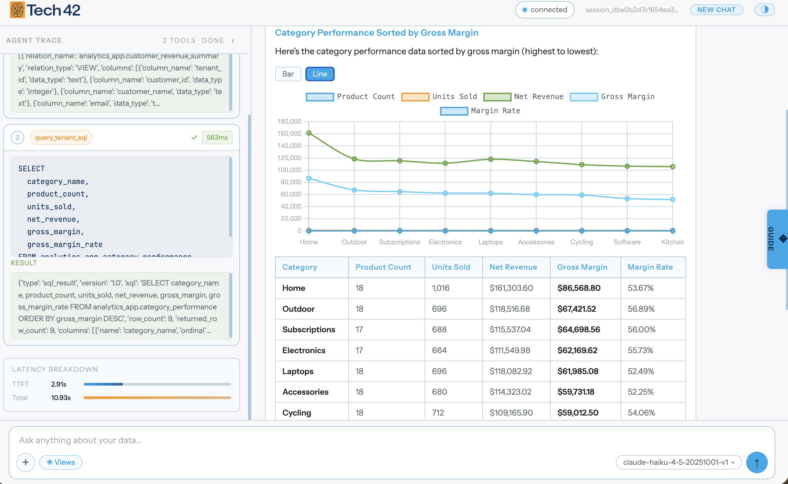
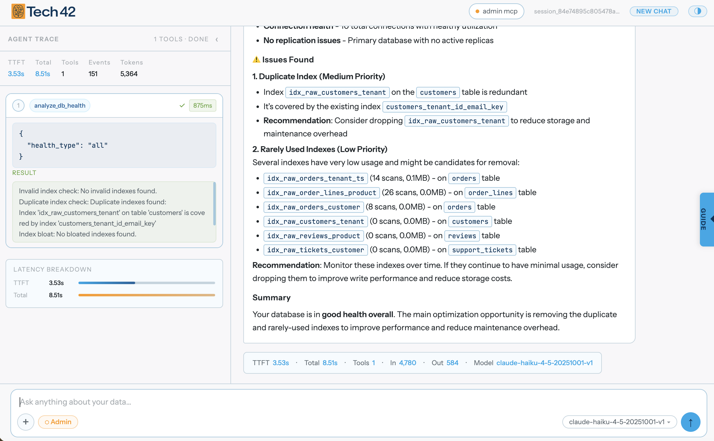

# postgres-mcp-demo

**Live demo: [sqlagent.tech42demo.com](https://sqlagent.tech42demo.com/)**

**Business query** — ask a natural-language question, get SQL-generated results:



**DB optimization** — inspect and optimize queries across the full schema:



Demo of AWS AgentCore invoking a PostgreSQL database through the Postgres MCP server using text-to-SQL. The agent runs on AWS Bedrock AgentCore and queries a multi-tenant analytics database via two MCP server deployments — one tenant-scoped (Views) and one unrestricted (Admin).

## Architecture

```
Jupyter Notebook  (text2sql_postgres_mcp_example.ipynb)
      │
      ▼
AWS Bedrock AgentCore Runtime  (deploy_agentcore_agent_cf.sh)
      │
      ├──▶  Views MCP Server  (deploy_views_mcp_cf.sh)   — tenant mode, read-only views
      └──▶  Admin MCP Server  (deploy_admin_mcp_cf.sh)   — admin mode, full DB access
                    │
                    ▼
            PostgreSQL (RDS)  (deploy_demo_db_tf.sh)
```

## Prerequisites

### 1. Subscribe on AWS Marketplace

Before deploying, subscribe to both Tech 42 products in your AWS account:

- **[Tech 42 AgentCore](https://aws.amazon.com/marketplace/pp/prodview-qizrc6sk6fb7a)** — required for `deploy_agentcore_agent_cf.sh`
- **[Tech 42 PostgreSQL Text-to-SQL MCP Server](https://aws.amazon.com/marketplace/pp/prodview-upn53f2cj47ds)** — required for `deploy_views_mcp_cf.sh` and `deploy_admin_mcp_cf.sh`

Click **Subscribe** on each product page before deploying.

### 2. Requirements

- AWS CLI v2 configured with a profile that has CloudFormation, ECS, ECR, RDS, Secrets Manager, and Bedrock permissions
- Terraform >= 1.5
- `psql` or Docker — the schema initializer runs SQL against the RDS instance; set `demo_postgres_mcp_schema_initializer` in `terraform/demo.tfvars` to `"psql"` or `"docker"`

## Deploy

### Step 1 — Bootstrap remote state (one-time per account)

Terraform state is stored in S3. Before the first deploy in a new AWS account, create the S3 bucket and DynamoDB lock table:

```bash
AWS_PROFILE=my-profile ./terraform/bootstrap/bootstrap.sh
```

The script prints the values to put in a backend config file. Copy the example and fill them in:

```bash
cp terraform/backend.hcl.example terraform/backend.sandbox.hcl
# edit terraform/backend.sandbox.hcl with the values printed above
```

Backend config files are git-ignored — each account gets its own file. The deploy script defaults to `terraform/backend.sandbox.hcl`. For multiple accounts on one machine, use named files (`backend.prod.hcl`) and pass `BACKEND_CONFIG=terraform/backend.prod.hcl` when deploying in `deploy_demo_db_tf.sh`.

### Step 2 — Deploy the demo database

Before the first deploy, copy the tfvars example and fill in your settings:

```bash
cp terraform/terraform.tfvars.example terraform/demo.tfvars
# edit terraform/demo.tfvars:
#   - set demo_postgres_mcp_allowed_cidr_blocks to your public IP  (required for schema init)
#   - set demo_postgres_mcp_schema_initializer to "psql" or "docker"
```

Then deploy:

```bash
./deploy_demo_db_tf.sh
```

This provisions the RDS PostgreSQL instance, subnet group, security group, and Secrets Manager URIs via Terraform, then runs the schema initializer against the RDS endpoint. The apply takes ~5 minutes (RDS creation).

> **Subnet and connectivity requirement:** The subnets in `demo_postgres_mcp_subnet_ids` must be public subnets (route table has a `0.0.0.0/0` → IGW route) and `demo_postgres_mcp_publicly_accessible = true`. The schema initializer runs locally and connects to RDS over the public internet — a private-only subnet or missing CIDR allowlist entry will cause it to time out.

Override defaults inline if needed:

```bash
AWS_PROFILE=my-profile AWS_REGION=us-west-2 ./deploy_demo_db_tf.sh
TFVARS_FILE=terraform/custom.tfvars ./deploy_demo_db_tf.sh
BACKEND_CONFIG=terraform/backend.prod.hcl ./deploy_demo_db_tf.sh
```

Key outputs written to state:

| Output | Description |
|---|---|
| `demo_postgres_mcp_database_endpoint` | RDS hostname:port |
| `demo_postgres_mcp_admin_database_uri_secret_arn` | Admin URI in Secrets Manager |
| `demo_postgres_mcp_raw_database_uri_secret_arn` | Raw read-only role URI |
| `demo_postgres_mcp_views_database_uri_secret_arn` | Views read-only role URI |

### Step 3 — Deploy the MCP servers

Both scripts deploy into the existing RDS VPC and auto-discover the VPC ID, subnets, RDS security group, and VPC endpoint security groups from the deployed RDS instance using `DB_IDENTIFIER`.

**Views MCP server** (tenant-scoped, read-only analytics views):

```bash
./deploy_views_mcp_cf.sh
```

The Views script fetches `DATABASE_URI` automatically from the Terraform-managed Secrets Manager secret (`demo_postgres_mcp_views_database_uri_secret_arn`). No manual credential retrieval is needed. Override `DB_URI_SECRET_ARN` if the secret ARN changes:

```bash
DB_URI_SECRET_ARN=$(terraform -chdir=terraform output -raw demo_postgres_mcp_views_database_uri_secret_arn) \
  ./deploy_views_mcp_cf.sh
```

**Admin MCP server** (unrestricted, full database access):

```bash
./deploy_admin_mcp_cf.sh
```

The Admin script also fetches `DATABASE_URI` automatically from its Terraform-managed secret (`demo_postgres_mcp_admin_database_uri_secret_arn`). Override `DB_URI_SECRET_ARN` if the secret ARN changes:

```bash
DB_URI_SECRET_ARN=$(terraform -chdir=terraform output -raw demo_postgres_mcp_admin_database_uri_secret_arn) \
  ./deploy_admin_mcp_cf.sh
```

Both scripts handle create vs. update automatically and delete/recreate if the stack is in `ROLLBACK_COMPLETE`. Stack outputs including the MCP endpoint URL are printed on completion.

> **VPC with existing endpoints:** If your VPC already has interface endpoints for Secrets Manager, ECR, and CloudWatch Logs (private DNS enabled), both deploy scripts will skip creating new ones (`CreateVpcEndpoints=false`) and instead auto-discover the endpoint security groups and add ingress rules for the ECS tasks. No manual configuration needed.

### Step 4 — Deploy the AgentCore agent runtime

```bash
./deploy_agentcore_agent_cf.sh
```

### Step 5 — Run the notebook

Open `text2sql_postgres_mcp_example.ipynb` in Jupyter. Set `AWS_PROFILE` at the top of the Configuration cell to match your AWS CLI profile — everything else (AgentCore runtime ARN, MCP endpoints, API keys) is resolved automatically from the CloudFormation stack outputs.

```bash
pip install jupyter
jupyter notebook text2sql_postgres_mcp_example.ipynb
```

The notebook covers:

| Section | What it tests |
|---|---|
| **Views MCP** | Tenant-scoped KPI queries, non-allowed tenant rejection, read-only enforcement |
| **Admin MCP** | Full schema listing, DB health check, slow query analysis, index recommendations, query optimization |
| **Views vs Admin** | Side-by-side speed comparison on the same query |

## Tear Down

Delete the MCP and AgentCore stacks:

```bash
for stack in demo-postgres-mcp-views demo-postgres-mcp-admin demo-postgres-mcp-agent; do
  AWS_PROFILE=my-profile aws cloudformation delete-stack --stack-name $stack --region us-east-1
done
```

Destroy the RDS database and supporting infrastructure:

```bash
terraform -chdir=terraform destroy \
  -var-file=demo.tfvars \
  -var="region=us-east-1"
```
